# Node.js Authentication System

This project contains a complete authentication system using Node.js, Express, and MongoDB. It includes features like sign up, sign in, sign out, password reset, and social authentication (Google). The project is structured to be scalable with separate components for models, controllers, and routes.

## Features Implemented
- **Sign-up with Email**: Create an account using your email and password.
- **Sign-in**: Log into your account securely.
- **Sign Out**: Log out of your session.
- **Reset Password**: You can reset your passwords after signing in.
- **Encrypted Passwords**: Passwords are securely stored using encryption.
- **Google Login/Signup**: Sign in or sign up using your Google account.
- **Forgot Password**: Reset your password via email.
- **Password Strength Validation**: Notifications are displayed for unmatching passwords during sign up and incorrect passwords during sign in.
- **reCAPTCHA Integration**: Protects against bot traffic on sign up and login pages.

### Testing
**Sign-up with Email + Encrypted Passwords**
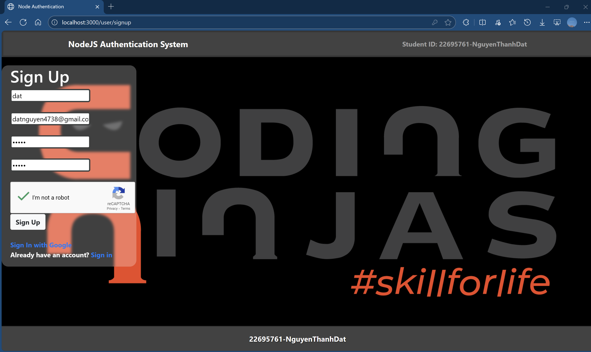
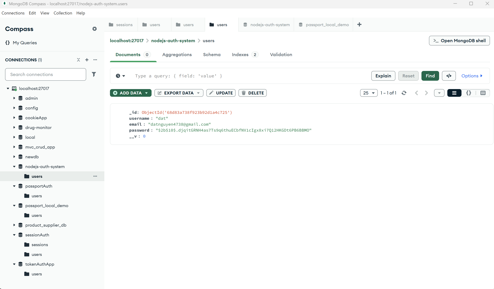
- **reCAPTCHA Integration**
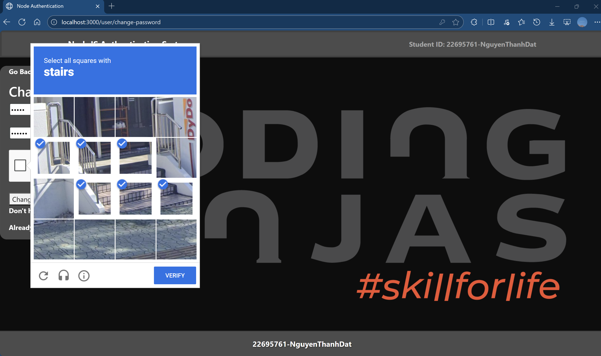
- **Sign-in**
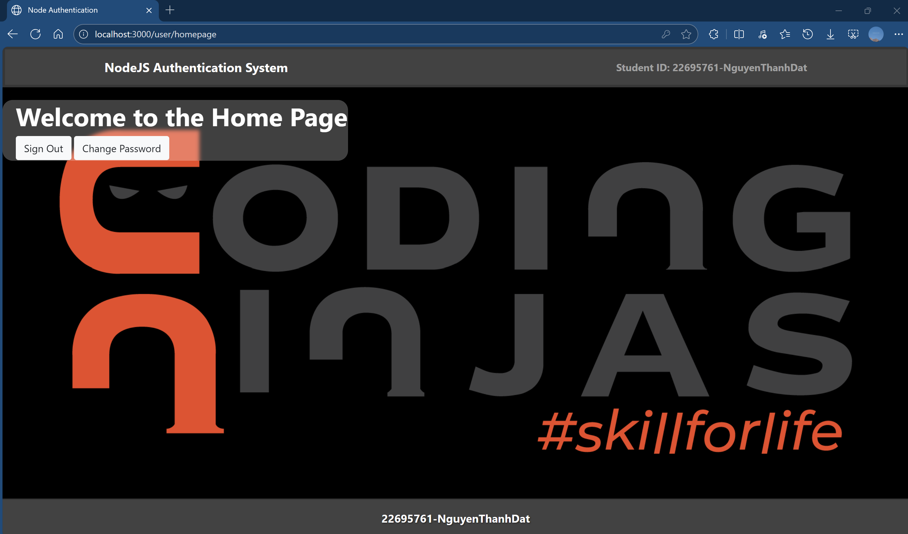
- **Reset Password**
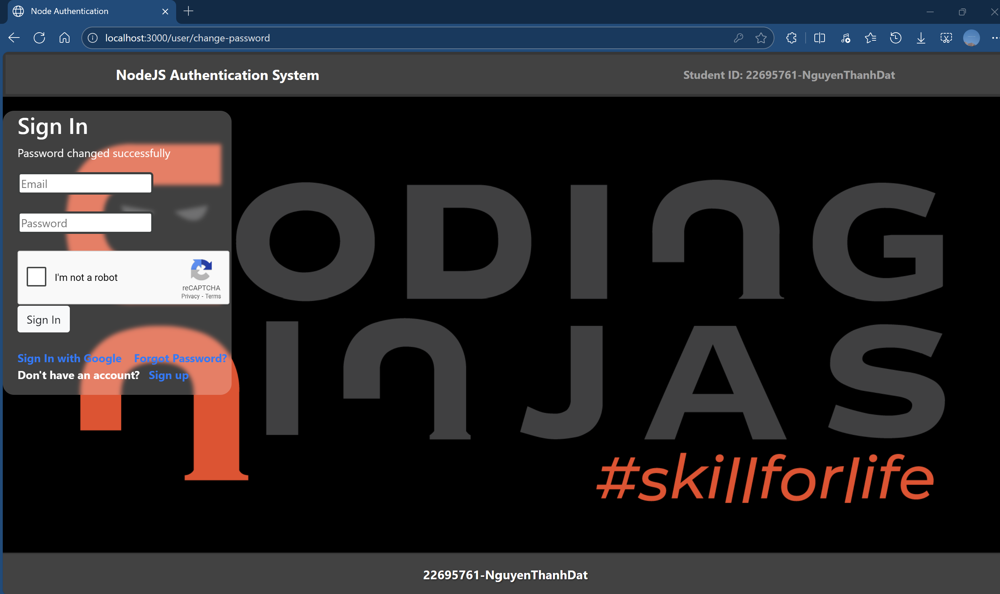
- **Sign Out**

- **Forgot Password**
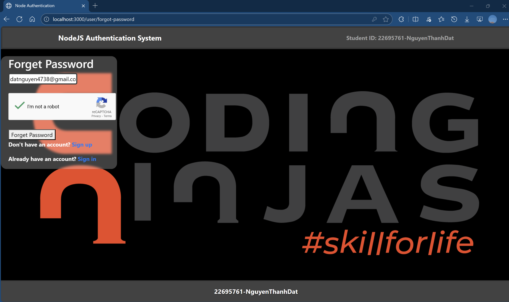
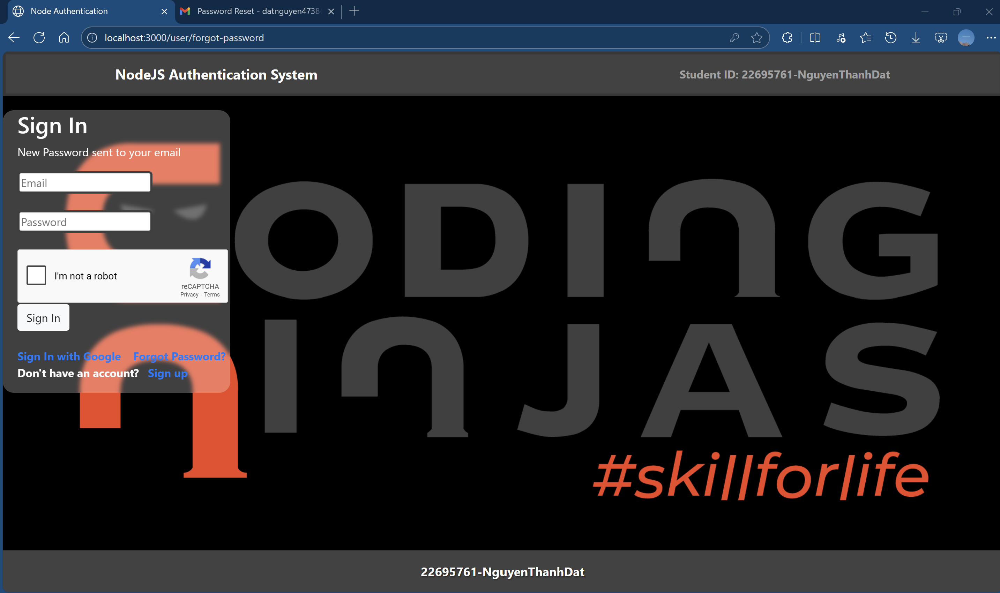
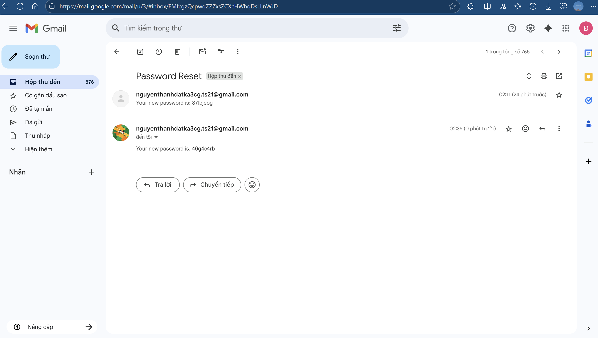
- **Password Strength Validation**
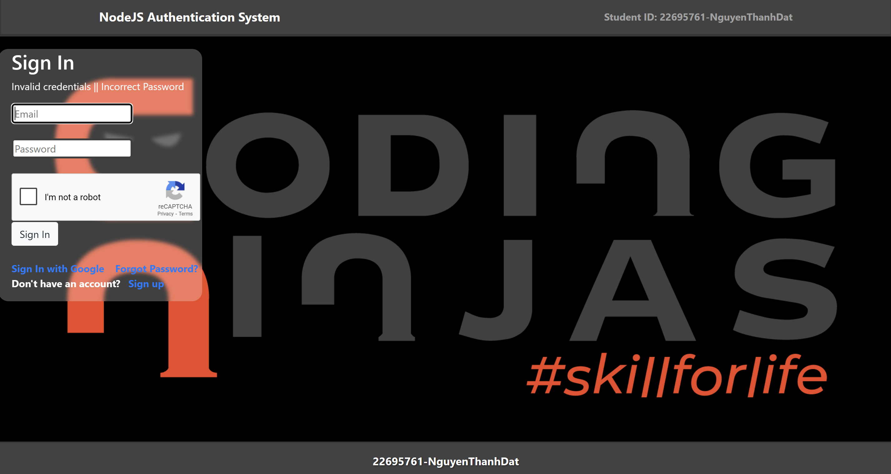
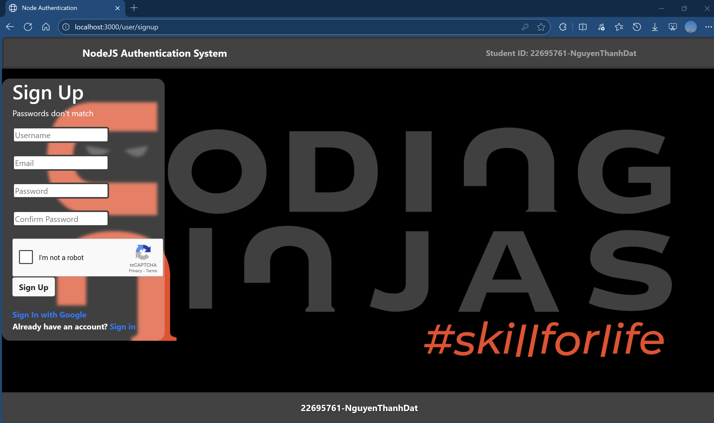
- **Google Login/Signup**
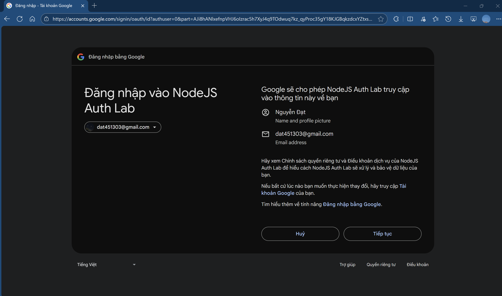
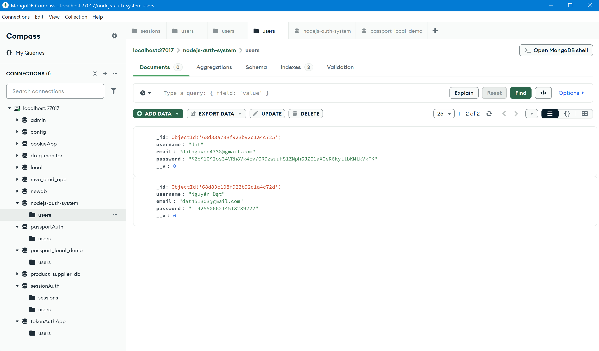