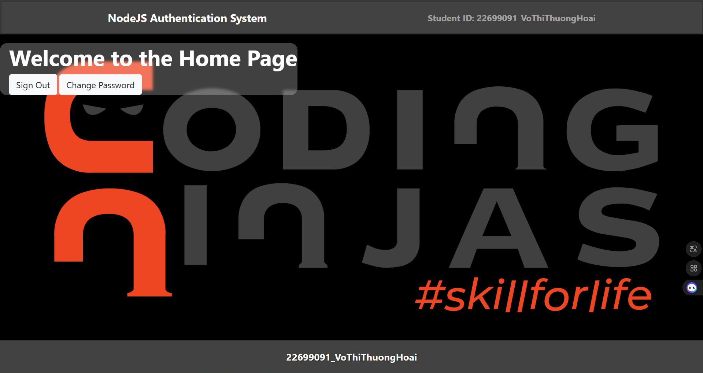
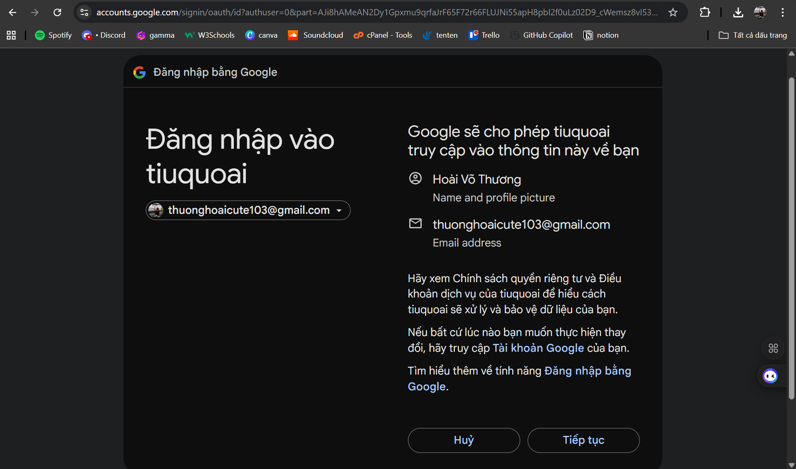
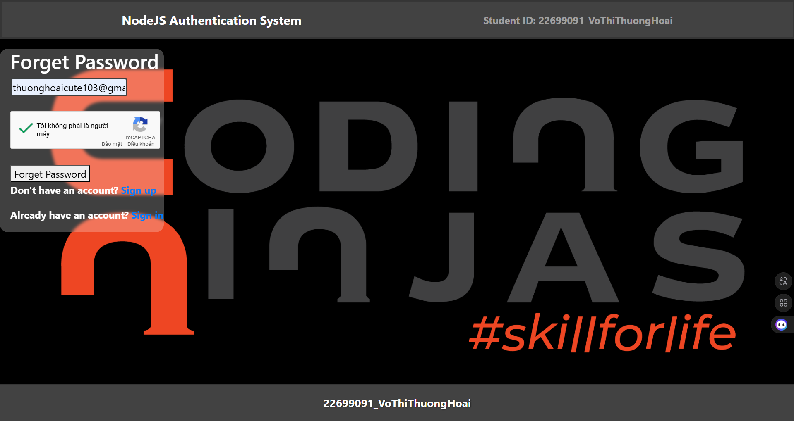
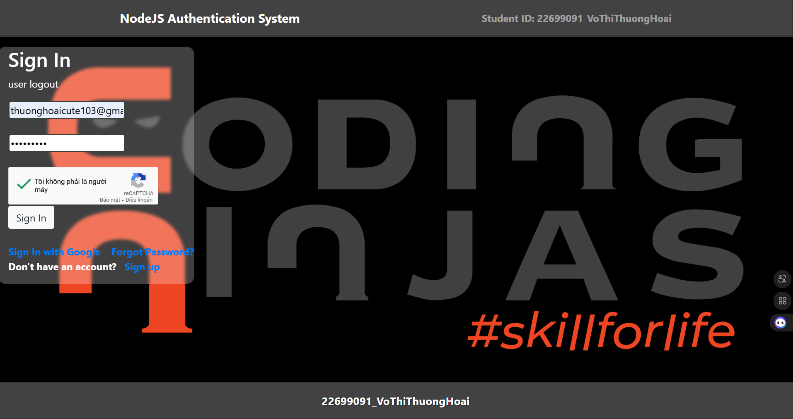

# NodeJS Authentication System

Ứng dụng **Authentication System** với các chức năng cơ bản:
- Đăng nhập bằng tài khoản nội bộ
- Đăng nhập với Google OAuth 2.0
- Đăng xuất
- Quên mật khẩu (reset password)
- Tích hợp Google reCAPTCHA
- Gửi email (NodeMailer)

---

## Công nghệ sử dụng
- **Node.js** + **Express**
- **MongoDB** + **Mongoose**
- **Passport.js** (Local Strategy, Google OAuth)
- **Nodemailer**
- **Google reCAPTCHA**


---

## Chạy ứng dụng

```bash
# Cài dependencies
npm install

# Chạy dev với nodemon
npm start
```

Mở trình duyệt tại:  `http://localhost:3000`

---

## Demo giao diện

### 1. Đăng nhập


### 2. Đăng nhập với Google
  


### 3. Quên mật khẩu


### 4. Đăng xuất


---
